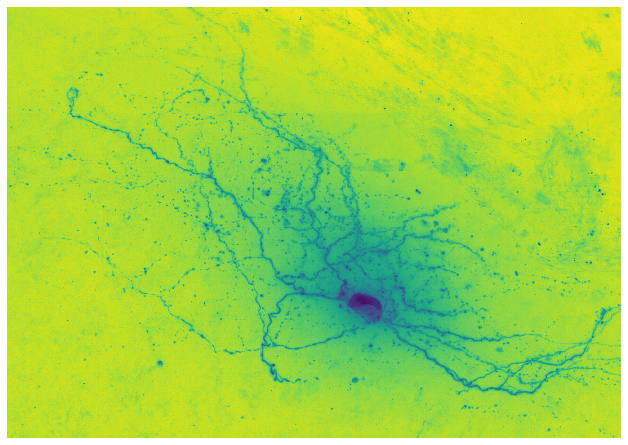
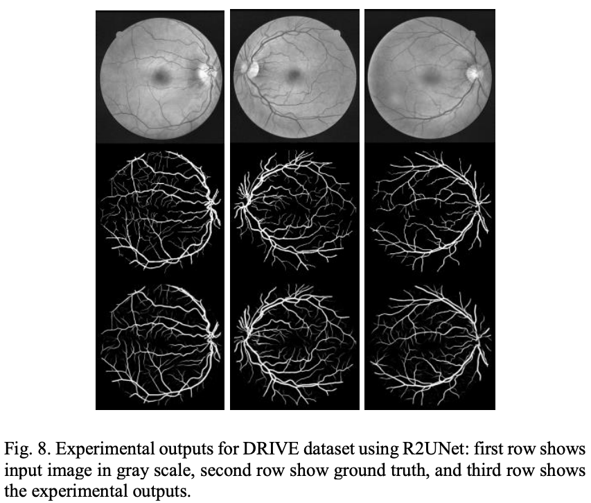

# U-Net

U-Net is pretty much the go-to model architecture for biomedical image segmentation. Yet stock U-Net has not yet been shown to be particularly effective when applied to images of neurons. 

On the other hand, recurrent variants might well be a fruitful avenue of research. For example, there is a 2018 pre-print[1<sip>](https://arxiv.org/pdf/1802.06955.pdf) which seems promising. The recurrent aspect allows the model to maintain an internal memory/state about remote areas of a given neuron. Neurons are very, very long compared to other cells. The recurrence can span such distances. In the pre-print recurrent U-Net is applied to retinas.

# References
- [U-Net: Convolutional Networks for Biomedical Image Segmentation](https://lmb.informatik.uni-freiburg.de/people/ronneber/u-net/)
- Recurrent
  - [Recurrent U-Net for Resource-Constrained Segmentation](https://arxiv.org/pdf/1906.04913.pdf)
    - (Summer-2019 pre-print out of China)
    - This sort of model archetype might have enough smarts to tackle
      computer viz object recognition of neurons. Very complex
      structures, very repetitive though. One might even say recurrent.
  - [Recurrent Residual Convolutional Neural Network based on U-Net (R2U-Net) for Medical Image Segmentation](https://arxiv.org/pdf/1802.06955.pdf)

    
# Test
    
This is text with a [^1] rando foot note
    
[^1]: Text must start in column 1. <a href="http://tigue.com">Tigue</a>
