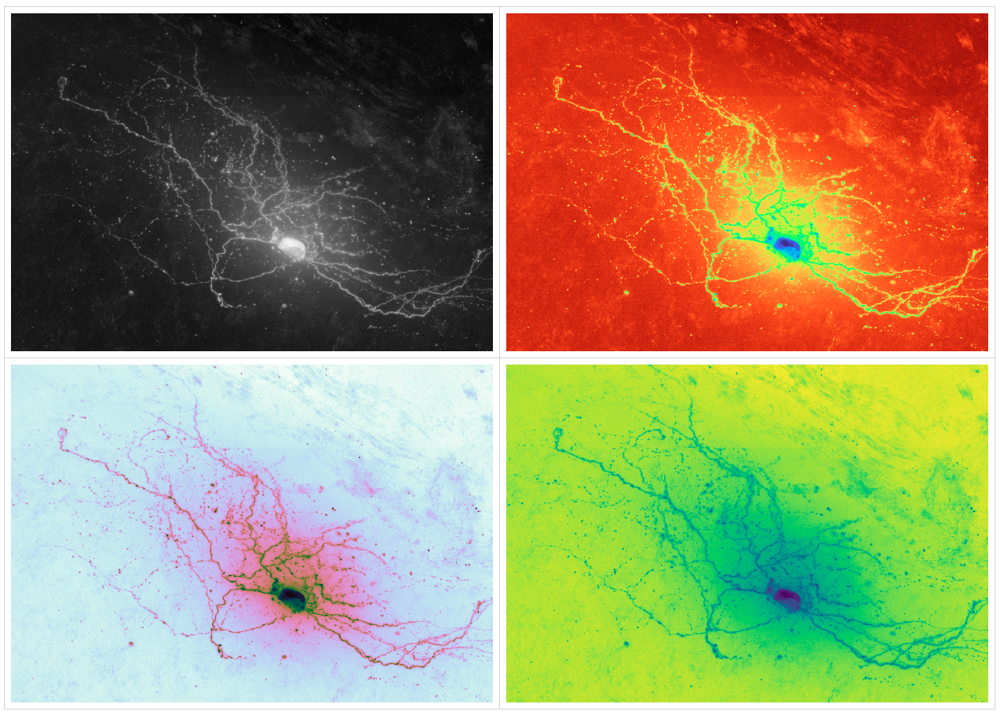

# Movable Camera

https://github.com/google/neuroglancer

    <iframe
      height="100%"
      width="100%"
      src="https://neuroglancer-demo.appspot.com/#!%7B%22dimensions%22:%7B%22x%22:%5B6.000000000000001e-9%2C%22m%22%5D%2C%22y%22:%5B6.000000000000001e-9%2C%22m%22%5D%2C%22z%22:%5B3.0000000000000004e-8%2C%22m%22%5D%7D%2C%22position%22:%5B5523.99072265625%2C8538.9384765625%2C1198.0423583984375%5D%2C%22crossSectionScale%22:3.7621853549999242%2C%22projectionOrientation%22:%5B-0.022613216191530228%2C-0.9335367679595947%2C0.3163532614707947%2C-0.16708776354789734%5D%2C%22projectionScale%22:4699.372698097029%2C%22layers%22:%5B%7B%22type%22:%22image%22%2C%22source%22:%22precomputed://gs://neuroglancer-public-data/kasthuri2011/image%22%2C%22name%22:%22original-image%22%2C%22visible%22:false%7D%2C%7B%22type%22:%22image%22%2C%22source%22:%22precomputed://gs://neuroglancer-public-data/kasthuri2011/image_color_corrected%22%2C%22name%22:%22corrected-image%22%7D%2C%7B%22type%22:%22segmentation%22%2C%22source%22:%22precomputed://gs://neuroglancer-public-data/kasthuri2011/ground_truth%22%2C%22selectedAlpha%22:0.63%2C%22notSelectedAlpha%22:0.14%2C%22segments%22:%5B%2213%22%2C%2215%22%2C%222282%22%2C%223189%22%2C%223207%22%2C%223208%22%2C%223224%22%2C%223228%22%2C%223710%22%2C%223758%22%2C%224027%22%2C%22444%22%2C%224651%22%2C%224901%22%2C%224965%22%5D%2C%22name%22:%22ground_truth%22%7D%5D%2C%22layout%22:%224panel%22%7D" ></iframe>

